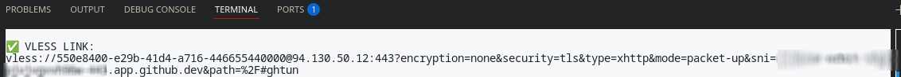

## setup
1. fork the repo
2. download visual studio code
3. download github codespaces extention for vscode
`https://marketplace.visualstudio.com/items?itemName=GitHub.codespaces`
`https://docs.github.com/en/codespaces/developing-in-a-codespace/using-github-codespaces-in-visual-studio-code`
5. open the codespace in vscode

## how to use
- wait some minutes for the codespace. it needs some time to setup everything.
- once it's ready, your vless link will be printed right there in terminal tab

- copy the link into your v2rayng (or your favorite proxy app)

## notes
- github gives you 120 free hours per cpu cores for a month
- so if your codespace has 2 cores, the limit will be 60 hours per month
- remember to stop the codespace when you aren't using it, to save your hours

tested on shecan (paid plan).
